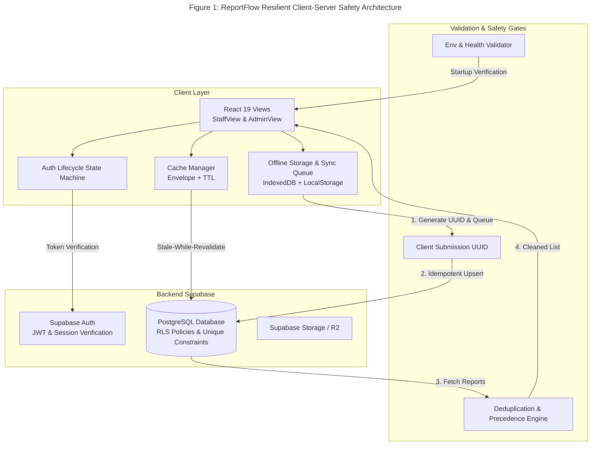
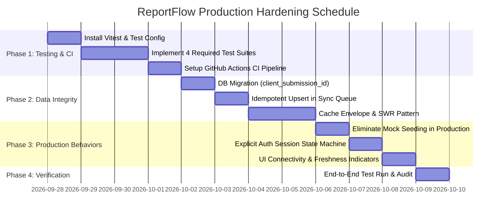

# ReportFlow: Production Readiness & Quality Assurance Implementation Plan

## Executive Summary & Problem Analysis

This implementation plan addresses three architectural bottlenecks identified in ReportFlow that prevent the application from achieving 100% production readiness:

| Pillar | Current Vulnerability | Target Production State |
| :--- | :--- | :--- |
| **1. Testing & CI Safety Net** | No automated unit/integration test suite or CI workflow; regressions only caught manually. | Full Vitest test suite with the 4 required suites (Auth, Offline Sync, Deduplication, Env Validation) and automated GitHub Actions CI pipeline. |
| **2. Data Integrity Model** | Client storage (`localStorage` & IndexedDB) acts as unchecked authority, causing stale cached users/deadlines, duplicate syncs, and client-side assumption drift. | Backend-authoritative single source of truth with server-side idempotency (`client_submission_id`), Cache-Envelope TTLs, and SWR (Stale-While-Revalidate). |
| **3. Explicit Production Behaviors** | Implicit dev behaviors active in production (mock data seeding on empty database, blind session restoration without token verification, ambiguous network states). | Explicit environment isolation (`PROD` vs `DEV`), verified session state machine, and transparent UI data freshness indicators. |

---

## Architectural State Diagram: Figure 1 — ReportFlow Resilient Client-Server Safety Architecture



---

## Phase 1: Automated Test Suite & CI Safety Net

### 1.1 Test Infrastructure Setup
We will install and configure **Vitest** with `@testing-library/react` and `jsdom`. Vitest integrates natively with Vite 8, leverages existing TypeScript configurations, and provides fast test execution with full ESM support.

#### Dependencies to Add
```bash
npm install -D vitest @testing-library/react @testing-library/jest-dom @testing-library/user-event jsdom @types/node
```

#### Configuration Files
1. **`vitest.config.ts`**:
   - Environment: `jsdom`
   - Setup files: `src/test/setup.ts`
   - Path aliases matching `vite.config.ts` (`@` -> `./src`)
   - Coverage threshold: 70%+ branch & statement coverage

2. **`src/test/setup.ts`**:
   - Polyfills for browser APIs: `localStorage`, `sessionStorage`, `matchMedia`, `crypto.randomUUID`, and `indexedDB` mock (`fake-indexeddb`).
   - Clean up DOM after each test run.

#### Repository Tracking Policy: Is `src/test` Tracked or Git-Ignored?
* **`src/test/` MUST be committed to Git (Tracked)**:
  - **CI/CD Execution**: Automated runners (such as GitHub Actions) clone the repository to run tests on every Pull Request. If `src/test/` were git-ignored, CI jobs would fail immediately due to missing test files.
  - **Zero Security Risk**: Test files contain no production API keys, database credentials, or secret tokens. All network responses and tokens are mocked with synthetic test fixtures.
  - **Zero Production Bundle Impact**: Vite's production bundler tree-shakes and isolates code based on `index.html` and entrypoint imports. `src/test/` is completely excluded from the production `dist/` output.
* **What IS Git-Ignored**:
  - `coverage/` (Vitest code coverage reports).
  - `.vitest/` (local test runner cache).
  - *Note on `.gitignore`*: The existing `.gitignore` contains `.github/*`. To allow GitHub Actions workflows to be committed, `.github/workflows/` will be explicitly un-ignored (`!.github/workflows/` or removing `.github/*`).

---

### 1.2 The Four Mandatory Test Suites

#### Suite 1: Authentication Flow Test (`src/test/auth.test.ts`)
Validates authentication rules, domain enforcement, and session integrity:
* **GVE Domain Verification**: Confirms emails without `@gve-group.com` are rejected before network submission.
* **Credentials Validation**: Tests sign-in with valid vs invalid credentials against mocked Supabase client.
* **Role Promotion & Distinction**: Verifies `info@gve-group.com` receives Super Administrator privileges while regular accounts inherit staff roles.
* **Session Expiry Handling**: Asserts that an expired JWT token or invalid refresh token triggers automatic session invalidation and redirects to sign-in.

```typescript
// Sample test structure
describe("Authentication Flow & Guardrails", () => {
  it("rejects non-GVE email domains with validation error", async () => {
    expect(isValidGveEmail("user@gmail.com")).toBe(false);
    expect(isValidGveEmail("engineer@gve-group.com")).toBe(true);
  });

  it("handles valid sign-in and initializes user session", async () => {
    // Tests auth state transition and session persistence
  });

  it("identifies and grants parent admin status to info@gve-group.com", () => {
    // Tests isSuperAdminUser checks
  });

  it("purges local session when backend returns JWT expired error", async () => {
    // Tests session revocation
  });
});
```

#### Suite 2: Offline Sync & Queue Test (`src/test/offlineSync.test.ts`)
Validates offline queueing, storage sanitization, network flush, and error recovery:
* **Queue Insertion**: Verifies `queueOfflineReport` creates a sanitized record in `localStorage` (stripping heavy base64 `dataUrl` strings) while storing full blobs in IndexedDB.
* **Automatic Flush on Reconnect**: Mocks `window.dispatchEvent(new Event("online"))` and verifies that pending reports are dispatched to Supabase with proper mapping.
* **Failed Network Graceful Handling**: Mocks network interruption during flush; asserts items stay in the queue marked with `status: "failed"` and error details, without losing technician data.
* **Queue Pruning**: Verifies synced items are removed from both `localStorage` and IndexedDB upon HTTP 200/201 confirmation.

#### Suite 3: Report Deduplication Test (`src/test/deduplication.test.ts`)
Validates that `deduplicateReportsList` correctly resolves collisions:
* **ID Deduplication**: Duplicate numeric database IDs are consolidated to a single record.
* **Logical Key Precedence**: If two entries share the same logical key (`${site}_${date}_${author}`), the engine applies the strict status hierarchy:
  $$\text{Approved (4)} > \text{Submitted (3)} > \text{Flagged (2)} > \text{Draft (1)}$$
* **Timestamp & ID Tie-Breaking**: When statuses match, the entry with the higher database ID / newer submission date is retained.
* **Chronological Sorting**: Confirms final output is sorted in descending order of submission time.

#### Suite 4: Environment Validation Test (`src/test/envValidation.test.ts`)
Validates critical deployment configuration:
* **Required Variable Checks**: Fails if `VITE_SUPABASE_URL` or `VITE_SUPABASE_ANON_KEY` is undefined or empty.
* **Placeholder Detection**: Catches unconfigured placeholders like `your-project-id.supabase.co` before app launch.
* **URL Format Validation**: Verifies that `VITE_SUPABASE_URL` is a valid HTTPS endpoint.
* **Production vs Development Enforcement**: Ensures mock fallback bypasses are disabled when `NODE_ENV === "production"`.

---

### 1.3 Continuous Integration (CI) Workflow
Create `.github/workflows/ci.yml` to run automated gates on every Pull Request and push to `main`:

```yaml
name: CI & Deployment Safety Net

on:
  push:
    branches: [main]
  pull_request:
    branches: [main]

jobs:
  validate:
    name: Lint, Type Check & Test
    runs-on: ubuntu-latest
    steps:
      - uses: actions/checkout@v4
      - uses: actions/setup-node@v4
        with:
          node-version: 20
          cache: "npm"

      - name: Install Dependencies
        run: npm ci

      - name: Code Formatting Check
        run: npx oxfmt --check src

      - name: TypeScript Type Check
        run: npm run type-check

      - name: Run Automated Test Suites
        run: npm run test:ci

      - name: Verify Production Build
        run: npm run build
```

---

## Phase 2: Data Integrity & Authoritative Server Model

### 2.1 Server-Side Idempotency & Unique Keys
Currently, if a technician is on a flaky connection (e.g. 2G in a rural mini-grid site), retrying a queue flush can insert multiple duplicate rows in `public.reports`.

#### Database Migration (`supabase/migrations/add_client_submission_id.sql`)
```sql
-- Add client_submission_id column for idempotent offline sync
ALTER TABLE public.reports 
ADD COLUMN IF NOT EXISTS client_submission_id TEXT UNIQUE;

-- Create an index for fast idempotency lookups
CREATE INDEX IF NOT EXISTS idx_reports_client_submission_id 
ON public.reports (client_submission_id);
```

#### Sync Queue Update (`src/lib/syncQueue.ts`)
Instead of a blind `insert(dbRow)`, execute an idempotent upsert:
```typescript
const { data, error } = await supabase
  .from("reports")
  .upsert(
    {
      ...dbRow,
      client_submission_id: item.id, // e.g. offline_1740000000_abc12
    },
    { onConflict: "client_submission_id" }
  );
```
*Result*: Even if a request is retried 10 times during a network reconnection storm, the database guarantees exactly one persistent record.

---

### 2.2 Cache Envelope & Stale-While-Revalidate (SWR) Pattern
Replace raw `localStorage` string sets with structured cache envelopes containing timestamps and TTLs:

```typescript
export interface CacheEnvelope<T> {
  data: T;
  cachedAt: number;     // Date.now() timestamp
  ttlMs: number;        // Time-to-live in milliseconds
  version: number;      // Schema version for migrations
}

export function getCachedWithTTL<T>(key: string): { data: T | null; isStale: boolean } {
  const raw = localStorage.getItem(key);
  if (!raw) return { data: null, isStale: true };
  try {
    const envelope: CacheEnvelope<T> = JSON.parse(raw);
    const isStale = Date.now() - envelope.cachedAt > envelope.ttlMs;
    return { data: envelope.data, isStale };
  } catch {
    return { data: null, isStale: true };
  }
}
```

#### SWR Strategy by Resource:
| Operational Resource | TTL | Revalidation Trigger | Fallback Strategy |
| :--- | :--- | :--- | :--- |
| **Members / Staff** | 10 mins | App mount, tab focus, admin member edits | Render cached immediately; revalidate in background; update UI smoothly. |
| **Deadlines** | 5 mins | App mount, online reconnect | Stale-while-revalidate; badge indicates overdue/synced. |
| **Reports Summary** | 2 mins | Window focus, new submission, pull-to-refresh | Deduplicate remote summaries against local offline queue. |
| **User Session** | Token `exp` | Each app load & every 30 mins | Verify JWT with `auth.getUser()`. If expired, trigger refresh or logout. |

---

### 2.3 Explicit Conflict Resolution Engine
When concurrent modifications occur (e.g. an Admin marks a report as "Approved" while a Field Technician edits notes offline):
1. **Status Authority**: Status transitions to `Approved` or `Flagged` by an Administrator always supersede local draft edits.
2. **Telemetry Protection**: If physical log entries (hourly inverter or battery readings) exist on the client and are missing from the server, client readings are preserved.
3. **Audit Trail**: Any conflict resolution generates an audit log entry in `report.feedback` detailing which fields were merged.

---

## Phase 3: Explicit Production Behaviors & Validation Rules

### 3.1 Total Elimination of Mock Seeding in Production
Currently, `useOfflineReports.ts` seeds hardcoded mock data (`REPORTS`) into IndexedDB whenever storage is empty:

```typescript
// CURRENT CODE IN useOfflineReports.ts:
setReports(REPORTS);
await localforage.setItem("reports", REPORTS);
```

#### Proposed Fix: Explicit Environment Gate
```typescript
// REVISED LOGIC:
const isDevMockEnabled = import.meta.env.DEV && import.meta.env.VITE_ENABLE_MOCK_DATA === "true";

if (isDevMockEnabled) {
  setReports(REPORTS);
  await localforage.setItem("reports", REPORTS);
} else {
  // In Production: clean empty state, no mock data pollution
  setReports([]);
  await localforage.setItem("reports", []);
}
```
* **Production**: Empty database renders a clean, professional empty state ("No reports submitted yet").
* **Development**: Mock data only loaded if explicitly enabled.

---

### 3.2 Explicit Session Lifecycle State Machine
Replace blind `JSON.parse(localStorage.getItem("reportflow_user_session"))` on startup with an explicit state machine:

```mermaid
stateDiagram-v2
    [*] --> BOOTSTRAPPING
    BOOTSTRAPPING --> CHECKING_SUPABASE_SESSION: Online
    BOOTSTRAPPING --> CHECKING_OFFLINE_CACHE: Offline

    CHECKING_SUPABASE_SESSION --> AUTHENTICATED: Token Valid & Member Exists
    CHECKING_SUPABASE_SESSION --> REFRESHING_TOKEN: Token Expired
    REFRESHING_TOKEN --> AUTHENTICATED: Refresh Succeeded
    REFRESHING_TOKEN --> UNAUTHENTICATED: Refresh Failed
    CHECKING_SUPABASE_SESSION --> UNAUTHENTICATED: Invalid Credentials / No Token

    CHECKING_OFFLINE_CACHE --> OFFLINE_SESSION: Cached Token Not Expired
    CHECKING_OFFLINE_CACHE --> UNAUTHENTICATED: Cached Token Expired or Missing

    OFFLINE_SESSION --> AUTHENTICATING: Reconnected Online
```



#### Validation Implementation
On application initialization:
1. Call `supabase.auth.getSession()`.
2. If session exists, call `supabase.auth.getUser()` to verify the token is not revoked on the Supabase backend.
3. If valid, reconcile `is_admin` status directly with the `public.members` record rather than trusting client-stored session claims.
4. If offline, decode JWT payload and inspect `exp`. If expired, deny access and require online sign-in rather than running with an unauthorized phantom session.

---

### 3.3 Explicit UI Data Freshness & Sync Indicators
To ensure users are never confused about whether they are seeing real-time data or cached data:
* **Global Connection Badge** in top navbar:
  * **[Connected]** (Solid green status pill): All records live and synchronized with Supabase.
  * **[Working Offline]** (Amber status pill): Changes saved locally; "$N$ items queued for automatic sync".
  * **[Syncing...]** (Animated pulse pill): Active synchronization in progress.
  * **[Sync Error]** (Red status pill): Displays error details with a 1-click "Retry Sync" button.
* **Per-Card Sync Indicator**: Reports submitted while offline display a subtle "Pending Sync" tag until confirmed by the server.

---

## Detailed Step-by-Step Implementation Roadmap



### Detailed Tasks Breakdown:

#### Task 1: Test Harness & CI Pipeline
* Files to create:
  * `vitest.config.ts`
  * `src/test/setup.ts`
  * `src/test/auth.test.ts`
  * `src/test/offlineSync.test.ts`
  * `src/test/deduplication.test.ts`
  * `src/test/envValidation.test.ts`
  * `.github/workflows/ci.yml`
* Files to modify:
  * `package.json` (add scripts: `"test": "vitest run"`, `"test:watch": "vitest"`, `"test:ci": "vitest run --coverage"`)

#### Task 2: Server-Side Idempotency & Database Hardening
* Files to create:
  * `supabase/migrations/20260928_add_client_submission_id.sql`
* Files to modify:
  * `supabase/schema.sql` (update base schema with `client_submission_id` and unique index)
  * `src/lib/syncQueue.ts` (replace plain insert with idempotent upsert)

#### Task 3: SWR & Cache Enveloping
* Files to create:
  * `src/lib/cacheManager.ts` (generic typed Cache Envelope with TTL and invalidation hooks)
* Files to modify:
  * `src/App.tsx` (reconcile cached members and deadlines using `cacheManager`)
  * `src/lib/reportService.ts` (integrate TTL and cache hydration)

#### Task 4: Explicit Production Guards & UI Polish
* Files to modify:
  * `src/hooks/useOfflineReports.ts` (gate mock reports behind `import.meta.env.DEV && VITE_ENABLE_MOCK_DATA`)
  * `src/constants/defaults.ts` (provide clean empty state defaults for production)
  * `src/App.tsx` (explicit session validation on boot, session lifecycle status)
  * `src/components/NetworkStatusBanner.tsx` (or top bar indicator for live vs cached status)

---

## Verification & Acceptance Criteria

| Criteria | Verification Method | Success Metric |
| :--- | :--- | :--- |
| **Automated Tests** | Run `npm run test:ci` | All 4 test suites pass with 0 failures and >70% coverage on tested modules. |
| **CI Safety Net** | Push a PR with a broken test | GitHub Actions CI automatically catches the failure and blocks merge. |
| **Idempotency** | Trigger `flushOfflineQueue()` 5 times concurrently in test | Exactly 1 record created in database per offline report; 0 duplicates. |
| **Production Mock Gate** | Build with `NODE_ENV=production` and inspect fresh IndexedDB | Reports list is clean `[]`; no dummy mock entries loaded. |
| **Session Validity** | Invalidate user session in Supabase Dashboard and refresh app | App immediately detects revoked token and prompts login, avoiding stale admin state. |
| **Type Integrity** | Run `npm run type-check` | 0 TypeScript errors. |

---

## Immediate Next Actions

To proceed with implementation, the recommended sequence is:
1. **Initialize Phase 1**: Install Vitest dependencies and set up the test runner with the 4 mandatory test suites.
2. **Execute Phase 2**: Apply the database migration for `client_submission_id` and upgrade `syncQueue.ts`.
3. **Execute Phase 3**: Enforce production environment isolation in `useOfflineReports.ts` and harden session lifecycle checks in `App.tsx`.
