# Implementation Plan: Structured Revision & Diffs (v1 vs v2) and Dynamic Compliance Score Engine

## 1. Overview & Objectives

This implementation plan delivers two core operational capabilities requested for ReportFlow:

1. **Structured Revision & Visual Diffs (v1 vs v2)**:
   - As specified in the roadmap, **version history and diffs only activate on reports that were flagged and resubmitted**.
   - When an administrator flags a report with feedback (e.g., *"Inverter 1 voltage on hour 12:00 is below 48V"*), and the technician edits and resubmits, ReportFlow automatically snapshots the original submission (v1) alongside the admin's notes, bumps the version to v2, and renders a side-by-side visual diff highlighting precisely which telemetry cells, checklist items, or notes were corrected.

2. **Dynamic Compliance Score Engine**:
   - Replaces static compliance defaults with an automated, authoritative calculation engine.
   - Evaluates each technician's actual track record: **On-Time Submission Rate** (against deadlines) and **First-Time Approval Rate** (approved without being flagged).
   - Dynamically recomputes and syncs compliance scores across `StaffView`, `AdminView` (Teams and Leaderboards), and the Supabase `public.members` table whenever reports are submitted, flagged, or approved.

---

## 2. Architecture & Data Flow

```mermaid
graph TD
    subgraph 1. Revision Lifecycle
        A[Admin Flags Report with Feedback] --> B[Report Status = 'Flagged']
        B --> C[Technician Opens Report in Staff Composer]
        C --> D[Technician Modifies Values & Submits]
        D --> E{Was Status Flagged?}
        E -->|Yes| F[Snapshot v1 + Feedback into revisionHistory]
        F --> G[Bump to Version 2 + Status = 'Submitted']
        G --> H[Render 'v2 Revised' Badge & Visual Diff Viewer in Admin & Staff Views]
    end

    subgraph 2. Compliance Score Engine
        I[Report State Change: Submit / Flag / Approve] --> J[calculateMemberCompliance]
        J --> K[Score = 50% On-Time SLA + 50% Approval SLA]
        K --> L[Update Member State & Cache Envelope]
        L --> M[Persist to Supabase public.members.compliance]
        M --> N[Real-Time Update on Staff Portal & Admin Teams Dashboard]
    end
```



---

## 3. Component 1: Structured Revision & Visual Diffs (v1 vs v2)

### 3.1 Type Definitions (`src/types/report.ts`)

Extend the `Report` model with structured revision snapshots:

```typescript
export interface FieldDiff {
  field: string          // e.g. "Hour 12:00 Inverter kW" or "Battery Voltage"
  previousValue: string  // e.g. "45 kW" or "47.2V"
  newValue: string       // e.g. "78 kW" or "52.4V"
  category: "telemetry" | "summary" | "attachment" | "general"
}

export interface ReportRevision {
  version: number                     // e.g. 1
  submittedAt: string                 // ISO timestamp of v1 submission
  flaggedAt?: string                  // ISO timestamp when admin flagged it
  feedback?: string                   // Reviewer's correction request notes
  diffs: FieldDiff[]                  // Computed list of modified fields
  snapshot: {
    summary: string
    gveData?: GveDailyRecordData
    gveWeeklyData?: GveWeeklyRecordData
    gveQuarterlyData?: GveQuarterlyRecordData
    attachmentsCount: number
  }
}

export interface Report {
  // Existing fields...
  id: number
  title: string
  author: string
  department: string
  type: ReportType
  submitted: Date
  status: ReportStatus
  summary: string
  feedback?: string
  attachments?: ReportAttachment[]
  gveData?: GveDailyRecordData
  gveWeeklyData?: GveWeeklyRecordData
  gveQuarterlyData?: GveQuarterlyRecordData
  client_submission_id?: string
  
  // New Versioning Fields
  version?: number                    // Defaults to 1; becomes 2, 3 on resubmission
  revisionHistory?: ReportRevision[]  // Populated ONLY when flagged and resubmitted
}
```

### 3.2 Database Migration (`supabase/migrations/20261001_add_revision_history.sql`)

```sql
-- Add version and revision_history columns to public.reports
ALTER TABLE public.reports 
ADD COLUMN IF NOT EXISTS version INTEGER DEFAULT 1,
ADD COLUMN IF NOT EXISTS revision_history JSONB DEFAULT '[]'::jsonb;
```

### 3.3 Automatic Diff Detection (`src/lib/diffCalculator.ts`)

Create a utility function to compare the pre-edit snapshot against the revised data:
- Compares hourly telemetry rows (Inverter kW, Battery Voltage, Solar Radiation, Energy Load).
- Compares summary text.
- Compares attachments count.
- Returns an array of human-readable `FieldDiff` entries (e.g. `Hour 12:00 Inverter kW: 45 -> 78`).

### 3.4 Snapshotting upon Resubmission (`src/StaffView.tsx`)

In `StaffView.tsx` form submission handler:
1. When submitting an edit where `editingReportId !== null`:
2. Find `existingReport = reports.find(r => r.id === editingReportId)`.
3. If `existingReport.status === "Flagged"`:
   - Compute `diffs = computeReportDiffs(existingReport, newReport)`.
   - Create `ReportRevision` containing v1 snapshot and `existingReport.feedback`.
   - Update `newReport`:
     ```typescript
     version: (existingReport.version || 1) + 1,
     revisionHistory: [...(existingReport.revisionHistory || []), revisionSnapshot],
     status: "Submitted", // Resubmitted for Admin re-evaluation
     feedback: undefined   // Cleared since technician addressed the flag
     ```

### 3.5 Visual Diff Viewer Component (`src/components/ReportDiffViewer.tsx`)

A dedicated UI component rendered inside the **Report Inspector Modal** (`AdminView.tsx`) and **Expanded Report Row** (`StaffView.tsx`):
- **Version Toggle**: Buttons to switch between `[v1 Original (Flagged)]` and `[v2 Revised (Current)]`.
- **Reviewer Feedback Banner**: Prominently shows the admin's original flag reason above the diffs.
- **Side-by-Side Field Diff Table**:
  - Highlights modified telemetry cells: previous value struck through in red (`48.2V`), revised value highlighted in bright emerald green (`52.4V`).
  - Unmodified cells remain neutral.
  - Summarizes total corrections made (e.g. *"3 values corrected by technician"*).

---

## 4. Component 2: Dynamic Compliance Score Engine

### 4.1 Calculation Engine (`src/lib/complianceEngine.ts`)

Create a dedicated compliance service based on operational mini-grid metrics:

$$\text{Compliance Score (\%)} = \text{Round}\left(0.50 \times \text{On-Time SLA} + 0.50 \times \text{Approval SLA}\right)$$

Where:
- **On-Time SLA (%)**: Percentage of submitted reports filed on or before scheduled department deadlines.
- **Approval SLA (%)**: Percentage of reports approved on first submission without requiring a flag:
  $$\text{Approval SLA} = \frac{\text{Approved Reports}}{\text{Total Reports}} \times 100$$
- **Flag Penalty**: Each unresolved flagged report applies a $-5\%$ penalty.
- **Resolution Bonus**: When a flagged report is corrected and approved, the penalty is restored to $+3\%$.
- **Score Bounds**: Clamped between $50\%$ and $100\%$ (default $100\%$ for members with $\le 1$ report).

### 4.2 Real-Time Recalculation & Supabase Sync

Whenever a report transition occurs:
1. **Technician Submits Report** $\rightarrow$ Re-evaluate on-time SLA.
2. **Admin Flags Report** $\rightarrow$ Re-evaluate approval SLA, deduct flag penalty.
3. **Technician Resubmits Flagged Report** $\rightarrow$ Move from flagged to revision under review.
4. **Admin Approves Report** $\rightarrow$ Award approved SLA points, restore compliance.

**Sync Hook**:
```typescript
export async function syncMemberCompliance(
  authorEmail: string,
  allReports: Report[],
  deadlines: Deadline[]
): Promise<number> {
  const result = calculateMemberCompliance(authorEmail, allReports, deadlines);
  
  // 1. Update local cache
  updateCachedMemberCompliance(authorEmail, result.score);
  
  // 2. Persist to Supabase if online
  if (navigator.onLine) {
    await supabase
      .from("members")
      .update({ compliance: result.score })
      .eq("email", authorEmail);
  }
  
  return result.score;
}
```

### 4.3 UI Integrations

1. **Staff Portal (`src/StaffView.tsx`)**:
   - The "On-Time compliance" stat card now reflects the real computed score.
   - Hovering / tapping the score shows a breakdown popover:
     `94% Compliance (12 Submitted, 11 Approved, 1 Flagged & Corrected, 100% On-Time)`.

2. **Admin Command Center (`src/AdminView.tsx`)**:
   - **Teams View**: Member cards dynamically display updated compliance badges with colors:
     - $\ge 95\%$: Emerald Green (High Compliance)
     - $85\% - 94\%$: Blue / Slate (Normal)
     - $< 85\%$: Amber / Warning (Needs Review)
   - **Leaderboard & Compliance Table**: Automatically re-orders technicians by their real compliance rating.

---

## 5. File Changes Summary

| File | Change Type | Purpose |
| :--- | :--- | :--- |
| `src/types/report.ts` | Modify | Add `ReportRevision`, `FieldDiff`, `version`, and `revisionHistory` fields. |
| `src/lib/diffCalculator.ts` | **Create** | Utility to compare pre- and post-edit reports and extract field-level diffs. |
| `src/components/ReportDiffViewer.tsx` | **Create** | Reusable visual diff inspector with version toggles and green/red delta badges. |
| `src/lib/complianceEngine.ts` | **Create** | Mathematical compliance calculator and Supabase sync logic. |
| `src/StaffView.tsx` | Modify | Trigger snapshot on resubmit; show v2 tag and diffs in report history; dynamic score display. |
| `src/AdminView.tsx` | Modify | Embed `ReportDiffViewer` in Report Inspector; trigger compliance updates on Approve/Flag. |
| `src/test/revisionDiff.test.ts` | **Create** | Unit tests for diff calculation, snapshotting, and version progression. |
| `src/test/complianceEngine.test.ts` | **Create** | Unit tests for compliance scoring, on-time calculations, and edge cases. |

---

## 6. Verification & Acceptance Criteria

1. **Structured Revision & Diff Test**:
   - Admin flags a submitted report with comment: *"Hour 12:00 Inverter power seems too low."*
   - Log in as the author in Staff Portal $\rightarrow$ Report shows `[Flagged]` with admin notes.
   - Click **Edit**, change Hour 12:00 power from `20 kW` to `75 kW`, and click **Submit Report**.
   - **Verify**: Status returns to `[Submitted]`, version is `v2`.
   - Open Report in Admin Inspector:
     - `v2 (Revised)` badge is displayed.
     - Toggle **"Show Field Diffs"** $\rightarrow$ Shows red strike-through `20 kW` and emerald green `75 kW`.
     - Admin flag feedback note is clearly displayed above the diff.

2. **Compliance Score Test**:
   - Initial technician compliance is $100\%$.
   - Flagging their report automatically drops compliance (e.g. to $95\%$).
   - Correcting and approving the report increases compliance back to $98\% - 100\%$.
   - Supabase `public.members.compliance` is updated in the database.

3. **Regression & Build Verification**:
   - Run `npm run type-check` $\rightarrow$ 0 TypeScript errors.
   - Run `npm run test` $\rightarrow$ All tests pass (including new revision and compliance tests).
   - Run `npm run build` $\rightarrow$ Clean production Vite build.
